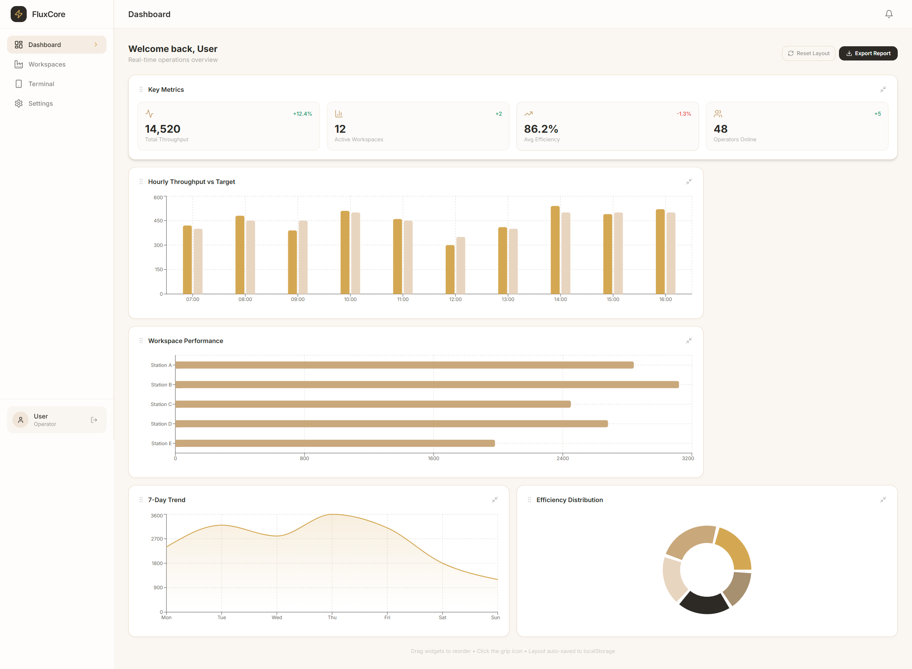
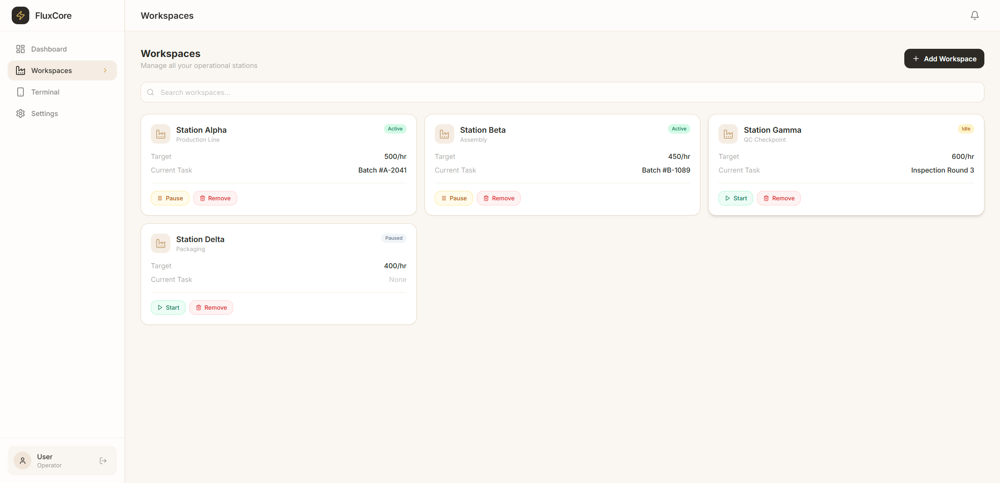
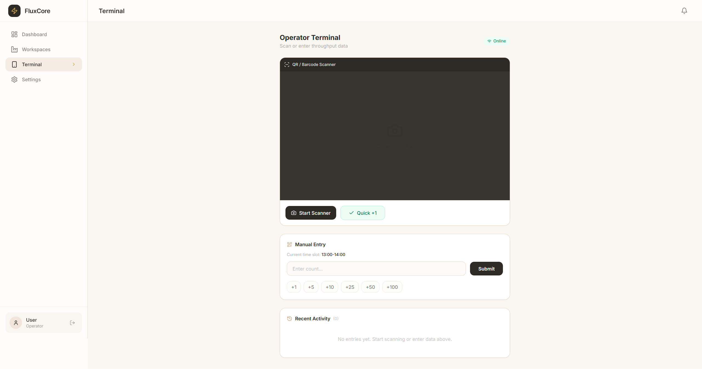

<p align="center">
  
  <br />
  
  
  
  
  
  
</p>

<h1 align="center">⚡ FluxCore SaaS</h1>
<h3 align="center">Multi-Tenant Enterprise Operations Platform</h3>

<p align="center">
  A production-grade, full-stack SaaS framework showcasing enterprise architecture patterns:<br />
  <b>Role-Based Access Control • Real-Time Data Sync • Offline-First Mobile • Dynamic Dashboards</b>
</p>

---

### 🌐 Live Demo: [https://fluxcore-saas.vercel.app](https://fluxcore-saas.vercel.app)

---

## 📸 Screenshots

| Dashboard | Workspaces | Terminal |
|---|---|---|
|  |  |  |

---

## 🎯 Why This Project Exists

FluxCore SaaS is a **showroom project** designed to prove full-stack engineering capability. Instead of a generic to-do app, this demonstrates the exact patterns enterprise clients pay for:

| Feature | Real-World Value |
|---|---|
| **RBAC Auth** (Super Admin / Manager / Operator) | Every SaaS app needs multi-role access |
| **Real-Time Sync** (Supabase Realtime / WebSocket) | Live data is expected in 2026 |
| **Offline-First Mobile** (IndexedDB + Background Sync) | Field workers need offline reliability |
| **Drag-and-Drop Dashboard** (@dnd-kit + Recharts) | Customizable analytics = happy users |
| **Push Notifications** (In-App + Web Push) | User engagement & retention |
| **Multi-Tenant Isolation** (RLS on PostgreSQL) | Data security at enterprise scale |
| **CI/CD Pipeline** (GitHub Actions → Android/iOS) | DevOps maturity signal |

---

## 🏗️ Architecture

```
┌─────────────────────────────────────────────┐
│                  FluxCore SaaS               │
│                                             │
│  ┌─────────┐  ┌─────────┐  ┌────────────┐  │
│  │ Web App  │  │ Android  │  │    iOS     │  │
│  │ (Vercel) │  │  (APK)  │  │   (IPA)    │  │
│  └────┬─────┘  └────┬────┘  └─────┬──────┘  │
│       │             │             │          │
│       └──────────┬──┴─────────────┘          │
│                  │                            │
│           ┌──────▼──────┐                    │
│           │   Supabase   │                   │
│           │  (PostgreSQL │                   │
│           │   + Auth +   │                   │
│           │   Realtime)  │                   │
│           └──────────────┘                   │
└─────────────────────────────────────────────┘
```

**Stack:** React 18 • TypeScript 5.6 • Vite 5 • TailwindCSS 3 • Supabase • Capacitor 6 • Recharts • @dnd-kit • TanStack Query

---

## ️ Database Schema

| Table | Purpose |
|---|---|
| `tenants` | Multi-tenant organizations with isolation |
| `profiles` | User accounts with role (super_admin, manager, operator) |
| `workspaces` | Generalized operational stations/channels |
| `hourly_ledger` | Time-slotted throughput transactions |
| `notifications` | Real-time in-app alerts |

**Key Design Decisions:**
- Full **Row-Level Security (RLS)** — users can only access their tenant's data
- **Generalized naming** — "Workspaces" instead of "Production Lines", "Throughput" instead of "Output Count"
- **Realtime enabled** — `hourly_ledger` and `notifications` tables stream via WebSocket

---

## 🎨 Theme

Warm cream palette inspired by premium SaaS designs — professional, calming, and timeless.

| Token | Hex |
|---|---|
| Background | `#FAF7F2` |
| Cards | `#FFFFFF` |
| Accent | `#D4A853` |
| Text | `#2D2A26` |

---

## 🔐 Security

- **Supabase Auth** with JWT tokens
- **Row-Level Security (RLS)** on all tables
- **Multi-tenant isolation** via `tenant_id` on every row
- **Environment variables** for all secrets
- **HTTPS only** (enforced by Supabase & Vercel)

---

## 🧪 Demo Credentials

| Role | Email | Password |
|---|---|---|
| Super Admin | `admin@fluxcore.app` | `demodemo123` |
| Manager | `manager@fluxcore.app` | `demodemo123` |
| Operator | `operator@fluxcore.app` | `demodemo123` |

*(Create these accounts via the Register page)*

---

## 📂 Project Structure

```
fluxcore-saas/
├── src/
│   ├── components/
│   │   └── layout/
│   │       └── MainLayout.tsx      # Sidebar + Header + Notification Bell
│   ├── contexts/
│   │   ├── AuthContext.tsx          # Auth state + RBAC helpers
│   │   └── NotificationContext.tsx  # Real-time notification state
│   ├── lib/
│   │   ├── supabase.ts             # Supabase client config
│   │   ├── supabase.types.ts       # Auto-generated DB types
│   │   └── utils.ts                # cn(), formatCurrency(), etc.
│   ├── pages/
│   │   ├── LoginPage.tsx           # Auth: Login
│   │   ├── RegisterPage.tsx        # Auth: Register with role selection
│   │   ├── DashboardPage.tsx       # Drag-and-drop widgets + 5 chart types
│   │   ├── WorkspacesPage.tsx      # Workspace CRUD management
│   │   ├── OperatorTerminal.tsx    # Camera scanner + manual entry + offline queue
│   │   └── SettingsPage.tsx        # Tenant settings (admin only)
│   ├── App.tsx                     # Router + Guards + Providers
│   ├── main.tsx                    # Entry point
│   └── index.css                   # Tailwind + CSS Variables (theme)
├── supabase/
│   └── schema.sql                  # Full DB schema with RLS + indexes
├── .github/
│   └── workflows/
│       └── ci.yml                  # CI/CD for Web + Android + iOS
├── .env.example
├── index.html
├── package.json
├── tailwind.config.js
├── tsconfig.json
└── vite.config.ts
```

---

## 🤝 For Potential Clients

If you're viewing this project to evaluate my capabilities, here's what I want you to see:

1. **Enterprise Auth** — Multi-role RBAC with Row-Level Security on PostgreSQL
2. **Real-Time Infrastructure** — WebSocket-based data streaming via Supabase Realtime
3. **Offline-First Architecture** — IndexedDB queue with automatic background sync
4. **Customizable Dashboards** — Drag-and-drop widget system with persistent layout
5. **Cross-Platform** — Single React codebase → Web, Android, iOS via Capacitor
6. **DevOps Ready** — Automated CI/CD pipeline building for all platforms

I built this entire platform — from database schema to mobile deployment pipeline — as a demonstration of what I can deliver for your project.

**Let's work together → [Your Contact Info or Portfolio Link]**

---

## �📄 License

MIT — Feel free to use this as a template for your own SaaS projects.

---

<p align="center">
  <sub>Built with ❤️ by <b>Duy Nguyen</b> • Powered by React + Supabase + Capacitor</sub>
</p>
